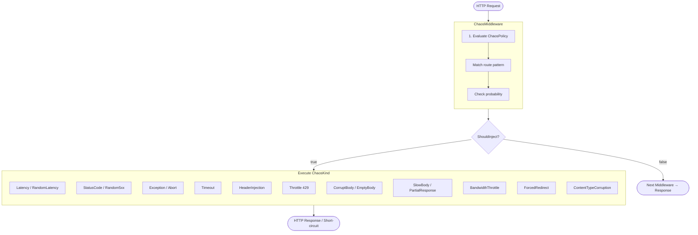

# MVFC.ChaosEngineering

A lightweight, high-performance ASP.NET Core middleware designed to inject controlled chaos into HTTP pipelines. It provides an essential toolkit for resilience testing in development and staging environments, helping teams build more robust distributed systems.

[](https://github.com/Marcus-V-Freitas/MVFC.ChaosEngineering/actions/workflows/ci.yml)
[](https://codecov.io/gh/Marcus-V-Freitas/MVFC.ChaosEngineering)
[](LICENSE)


[Português](README.pt-BR.md)

---

## Overview

`MVFC.ChaosEngineering` offers a fluent, policy-driven approach to chaos testing. By intercepting incoming HTTP requests, it can inject a wide range of configurable failure modes — from artificial latency and exceptions to corrupted response bodies and bandwidth throttling.

Rules are matched using route patterns, evaluated based on configurable probabilities, and strictly scoped to specific environments to ensure that chaos never inadvertently impacts production workloads.

| Package | Service | Downloads |
|---|---|---|
| **[MVFC.ChaosEngineering](src/MVFC.ChaosEngineering/README.md)** | Chaos injection middleware for ASP.NET Core applications. |  |

---

## Why Chaos Engineering?

Modern distributed systems are prone to unpredictable failures: cascading timeouts, partial network drops, sluggish consumers, and malformed upstream payloads. Standard testing methodologies often fail to catch these issues because they rely on stable infrastructure conditions.

`MVFC.ChaosEngineering` bridges this gap by introducing real-world HTTP failures directly into your ASP.NET Core pipeline. Since it operates in-process, there's no need for external proxies or sidecars. You retain full control over the "blast radius" using environment gating, ensuring that chaos is confined to `Development` or `Staging` and never leaks into `Production`.

---

## Key Features

- **16 Diverse Chaos Kinds**: Simulate exceptions, latency, random 5xx errors, timeouts, connection aborts, header injection, service throttling (429), body corruption, and more.
- **Fluent Configuration**: A readable, chainable `ChaosPolicyBuilder` API for effortless rule definition.
- **Flexible Route Matching**: Target specific endpoints (`/api/orders`) or entire path segments (`/api/payments/**`) using wildcard patterns.
- **Probabilistic Execution**: Fine-tune how often each rule fires using a probability range from `0.0` to `1.0`.
- **Request Filtering**: Scope chaos injection to specific requests based on HTTP headers (e.g., `X-Chaos: true`).
- **Dynamic Configuration**: Built-in support for `IOptionsMonitor`, allowing real-time policy updates without application restarts.
- **Observability & Metrics**: Integrated structured logging and OpenTelemetry-ready metrics (`System.Diagnostics.Metrics`).
- **Environment Gating**: Built-in safety mechanisms to restrict chaos to non-production environments.
- **Zero External Dependencies**: Lightweight implementation built directly on `Microsoft.AspNetCore.Http` and standard .NET abstractions.

---

## Installation

```bash
dotnet add package MVFC.ChaosEngineering
```

Or via the NuGet Package Manager:

```bash
Install-Package MVFC.ChaosEngineering
```

---

## Quick Start

```csharp
var policy = new ChaosPolicyBuilder()
    .OnEnvironments(ChaosEnvironment.Development, ChaosEnvironment.Staging)
    .ForRoute("/api/payments/**").WithProbability(0.3).WithLatency(TimeSpan.FromSeconds(3))
    .ForRoute("/api/orders").WithProbability(0.1).WithException<TimeoutException>()
    .Build();

app.UseChaos(policy);
```

```csharp
app.UseChaos(builder =>
    builder
        .OnEnvironments(ChaosEnvironment.Development)
        .ForRoute("/api/products").WithRandomLatency(TimeSpan.FromMilliseconds(200), TimeSpan.FromSeconds(2))
);
```

### Dynamic Configuration (Options Pattern)

Register the chaos services and define your policy via `IServiceCollection`. This enables real-time updates via `appsettings.json` or other configuration providers.

```csharp
// Program.cs
builder.Services.AddChaos(builder => {
    builder
        .OnEnvironments(ChaosEnvironment.Development, ChaosEnvironment.Staging)
        .ForRoute("/api/**").WithProbability(0.05).WithStatusCode(500);
});

// ...

app.UseChaos(); // Automatically resolves policy from DI
```

---

## How It Works



---

## Chaos Kinds

To simulate realistic service degradation, the middleware supports three primary execution behaviors:

- **Short-circuit**: The middleware returns a response immediately, bypassing the rest of the pipeline.
- **Pass-through + delay**: The request continues normally, but an artificial delay is introduced before forwarding.
- **Pass-through + intercept**: The middleware calls the next handler, captures the response, and modifies it before sending it to the client.

| Kind | Description | Behavior |
|---|---|---|
| `Exception` | Throws a configured exception (defaults to `ChaosException`). | Short-circuit |
| `Latency` | Introduces a fixed artificial delay. | Pass-through + delay |
| `RandomLatency` | Introduces a random delay within a specified `[min, max]` range. | Pass-through + delay |
| `StatusCode` | Returns a specific HTTP status code (e.g., 503). | Short-circuit |
| `RandomStatusCode` | Randomly selects a 5xx series status code (500, 502, 503, 504). | Short-circuit |
| `Timeout` | Simulates an unresponsive service by hanging indefinitely. | Short-circuit |
| `Abort` | Immediately terminates the TCP connection. | Short-circuit |
| `HeaderInjection` | Adds `X-Chaos-Injected` and custom headers to the response. | Pass-through + intercept |
| `Throttle` | Simulates rate limiting by returning HTTP 429 with `Retry-After`. | Short-circuit |
| `CorruptBody` | Returns a malformed or truncated JSON response body. | Short-circuit |
| `EmptyBody` | Returns an empty response body with `Content-Length: 0`. | Short-circuit |
| `SlowBody` | Streams the real response body in small chunks with a per-chunk delay. | Pass-through + intercept |
| `BandwidthThrottle` | Replays the response body at a fixed bytes-per-second rate. | Pass-through + intercept |
| `ForcedRedirect` | Forces a redirect (301/302) to a specific URL. | Short-circuit |
| `PartialResponse` | Writes a fraction of the response body and then aborts the connection. | Short-circuit |
| `ContentTypeCorruption` | Overwrites the `Content-Type` header with an invalid value. | Pass-through + intercept |

> **SlowBody vs BandwidthThrottle**: Use `SlowBody` when you need granular control over chunk size and timing. Use `BandwidthThrottle` when you want to simulate specific network throughput (e.g., 512 KB/s).

### 🧠 Internal Architecture

The library follows a **Strategy Pattern** for fault injection. Each `ChaosKind` is handled by a specialized `IChaosHandler` implementation, ensuring the middleware remains clean, maintainable, and highly performant (O(1) resolution via an internal registry).

### 🧪 Dynamic Exception Factory

You can now use a factory to decide which exception to throw based on the current `HttpContext`:

```csharp
policy.ForRoute("/api/orders/**")
      .WithException(context => new OrdersException("Custom error context: " + context.TraceIdentifier));
```

---

## Builder API

Define complex chaos policies using a clean, expressive API that mirrors the underlying `ChaosPolicyBuilder`:

```csharp
var policy = new ChaosPolicyBuilder()
    // Environment Safety & Overrides
    .OnEnvironments(ChaosEnvironment.Development, ChaosEnvironment.Staging)
    .WithEnvironmentOverride("LocalTesting") 
    
    // Scoped Configuration
    .ForRoute("/api/orders")
        .WithProbability(0.2)
        .WithStatusCode(503)
        
    .ForRoute("/api/payments/**")
        .WithProbability(0.05)
        .WithException<TimeoutException>()
        
    .ForRoute("/api/reports")
        .WithProbability(1.0)
        .WithBandwidthThrottle(bytesPerSecond: 1024)
        
    // Multi-criteria matching: Path + Header
    .ForRoute("/api/beta/**")
        .WithRequestHeader("X-Chaos-Enable", "true")
        .WithProbability(1.0)
        .WithException<NotImplementedException>()

    .Build();
```

---

## Environment Gating

`OnEnvironments` evaluates `ASPNETCORE_ENVIRONMENT` at `Build()` time. If the current environment does not match any listed value, `ChaosPolicy.Disabled` is returned and the middleware becomes a no-op with zero overhead.

```csharp
builder.OnEnvironments(ChaosEnvironment.Development);
// In Production → ChaosPolicy.Disabled → zero overhead
```

Use `WithEnvironmentOverride` to inject a fixed environment value in tests.

## Observability

The library is designed for production use, with deep integration into modern observability stacks:

### Metrics (OpenTelemetry)
It exposes several `Counter` and `Histogram` metrics under the `MVFC.ChaosEngineering` meter:
- `chaos.faults.injected`: Total number of faults injected (with `chaos.kind` and `chaos.route` tags).
- `chaos.requests.evaluated`: Total number of requests that passed through the middleware.
- `chaos.latency.duration`: A histogram of injected latency (p95/p99 analysis).

### Tracing
The middleware automatically enriches the current `Activity` with:
- `chaos.injected`: true/false
- `chaos.kind`: The type of fault
- `chaos.id`: Unique correlation ID for the specific fault
- `chaos.path`: The request path matching the rule

---

## Playground

The `playground/` folder contains a ready-to-run ASP.NET Core Minimal API with all 16 chaos kinds pre-configured — one endpoint per kind — backed by a .NET Aspire `AppHost` for easy local orchestration.

**Running the playground:**

```bash
cd playground/MVFC.ChaosEngineering.Playground.AppHost
dotnet run
```

**Pre-configured endpoints:**

| Route | Chaos Kind |
|---|---|
| `GET /api/orders/{id}` | `StatusCode` → 503 |
| `GET /api/payments/{id}` | `Exception` |
| `GET /api/slow` | `Latency` → 200ms |
| `GET /api/unstable` | `RandomStatusCode` |
| `GET /api/timeout` | `Timeout` |
| `GET /api/header-chaos` | `HeaderInjection` + custom header `X-Chaos-Scenario` |
| `GET /api/throttle` | `Throttle` → 429, Retry-After: 10s |
| `GET /api/corrupt-body` | `CorruptBody` |
| `GET /api/empty-body` | `EmptyBody` |
| `GET /api/slow-body` | `SlowBody` → 150ms/chunk, 32B |
| `GET /api/redirect` | `ForcedRedirect` → `/api/products` |
| `GET /api/random-latency` | `RandomLatency` → 50–500ms |
| `GET /api/partial` | `PartialResponse` → 32B |
| `GET /api/bandwidth` | `BandwidthThrottle` → 128B/s |
| `GET /api/wrong-content-type` | `ContentTypeCorruption` → text/plain |
| `GET /api/abort` | `Abort` |

---

## Project Structure

- **[src](src)**: Library source code for `MVFC.ChaosEngineering`.
- **[playground](playground)**: Demo API with all chaos kinds pre-configured + Aspire AppHost.
- **[tests](tests)**: Test suite covering all chaos kinds and policy evaluation.

---

## Changelog

See [CHANGELOG.md](CHANGELOG.md) for a history of changes and releases.

---

## Contributing

See [CONTRIBUTING.md](CONTRIBUTING.md).

## License

[Apache-2.0](LICENSE)
