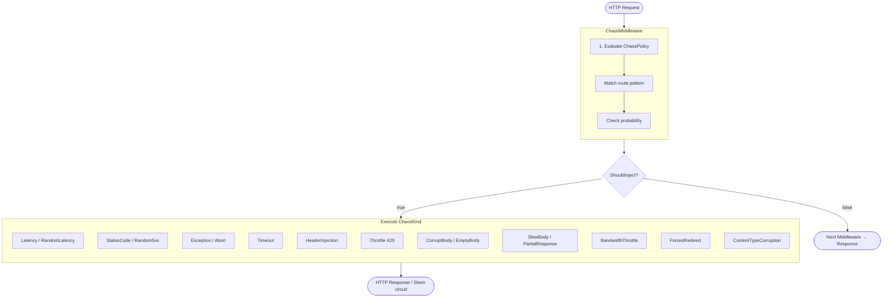

# MVFC.ChaosEngineering

Um middleware leve e de alta performance para ASP.NET Core, projetado para injetar caos controlado em pipelines HTTP. Fornece um conjunto essencial de ferramentas para testes de resiliência em ambientes de desenvolvimento e staging, auxiliando equipes na construção de sistemas distribuídos mais robustos.

[](https://github.com/Marcus-V-Freitas/MVFC.ChaosEngineering/actions/workflows/ci.yml)
[](https://codecov.io/gh/Marcus-V-Freitas/MVFC.ChaosEngineering)
[](LICENSE)


[English](README.md)

---

## Visão Geral

O `MVFC.ChaosEngineering` oferece uma abordagem fluida e baseada em políticas para testes de caos. Ao interceptar requisições HTTP, ele permite injetar uma ampla gama de modos de falha configuráveis — desde latência artificial e exceções até corpos de resposta corrompidos e limitação de largura de banda.

As regras são aplicadas usando padrões de rota, avaliadas com base em probabilidades configuráveis e restritas a ambientes específicos, garantindo que o caos nunca impacte fluxos de produção inadvertidamente.

| Pacote | Finalidade | Downloads |
|---|---|---|
| **[MVFC.ChaosEngineering](src/MVFC.ChaosEngineering/README.md)** | Middleware de injeção de caos para aplicações ASP.NET Core. |  |

---

## Por que Engenharia de Caos?

Sistemas distribuídos modernos são propensos a falhas imprevisíveis: timeouts em cascata, quedas parciais de rede, consumidores lentos e payloads malformados de serviços upstream. Metodologias de teste padrão frequentemente falham em capturar esses problemas por dependerem de condições estáveis de infraestrutura.

O `MVFC.ChaosEngineering` preenche essa lacuna introduzindo falhas HTTP reais diretamente no seu pipeline ASP.NET Core. Como opera nativamente no processo, não há necessidade de proxies externos ou sidecars. Você mantém controle total sobre o "raio de explosão" usando bloqueios por ambiente, garantindo que o caos seja confinado a `Development` ou `Staging`.

---

## Principais Funcionalidades

- **16 Tipos de Caos**: Simule exceções, latência, erros 5xx aleatórios, timeouts, aborto de conexão, injeção de headers, throttling (429), corrupção de body e muito mais.
- **Configuração Fluente**: API `ChaosPolicyBuilder` legível e encadeável para definição de regras sem esforço.
- **Matching de Rota Flexível**: Alveje endpoints específicos (`/api/orders`) ou segmentos inteiros (`/api/payments/**`) usando padrões de curinga.
- **Execução Probabilística**: Ajuste a frequência com que cada regra dispara usando uma probabilidade de `0.0` a `1.0`.
- **Filtros de Request**: Escope a injeção de caos para requisições específicas baseadas em headers HTTP (ex: `X-Chaos: true`).
- **Configuração Dinâmica**: Suporte nativo para `IOptionsMonitor`, permitindo atualizações de política em tempo real sem reiniciar a aplicação.
- **Observabilidade e Métricas**: Logging estruturado integrado e métricas prontas para OpenTelemetry (`System.Diagnostics.Metrics`).
- **Environment Gating**: Mecanismos de segurança integrados para restringir o caos a ambientes de não-produção.
- **Zero Dependências Externas**: Implementação leve construída diretamente sobre `Microsoft.AspNetCore.Http` e abstrações padrão do .NET.

---

## Instalação

```bash
dotnet add package MVFC.ChaosEngineering
```

Ou via NuGet Package Manager:

```bash
Install-Package MVFC.ChaosEngineering
```

---

## Início Rápido

```csharp
var policy = new ChaosPolicyBuilder()
    .OnEnvironments(ChaosEnvironment.Development, ChaosEnvironment.Staging)
    .ForRoute("/api/payments/**").WithProbability(0.3).WithLatency(TimeSpan.FromSeconds(3))
    .ForRoute("/api/orders").WithProbability(0.1).WithException<TimeoutException>()
    .Build();

app.UseChaos(policy);
```

```csharp
app.UseChaos(builder =>
    builder
        .OnEnvironments(ChaosEnvironment.Development)
        .ForRoute("/api/products").WithRandomLatency(TimeSpan.FromMilliseconds(200), TimeSpan.FromSeconds(2))
);
```

### Configuração Dinâmica (Options Pattern)

Registre os serviços de caos e defina sua política via `IServiceCollection`. Isso permite atualizações em tempo real via `appsettings.json` ou outros provedores de configuração.

```csharp
// Program.cs
builder.Services.AddChaos(builder => {
    builder
        .OnEnvironments(ChaosEnvironment.Development, ChaosEnvironment.Staging)
        .ForRoute("/api/**").WithProbability(0.05).WithStatusCode(500);
});

// ...

app.UseChaos(); // Resolve automaticamente a política via DI
```

---

## Como Funciona



---

## Tipos de Caos

Para simular a degradação real do serviço, o middleware suporta três comportamentos principais de execução:

- **Curto-circuito (Short-circuit)**: O middleware retorna uma resposta imediatamente, ignorando o restante do pipeline.
- **Passagem com atraso (Pass-through + delay)**: A requisição continua normalmente, mas um atraso artificial é introduzido antes do encaminhamento.
- **Passagem com interceptação (Pass-through + intercept)**: O middleware chama o próximo handler, captura a resposta e a modifica antes de enviá-la ao cliente.

| Tipo | Descrição | Comportamento |
|---|---|---|
| `Exception` | Lança uma exceção configurada (padrão: `ChaosException`). | Curto-circuito |
| `Latency` | Introduz um atraso artificial fixo. | Passagem com atraso |
| `RandomLatency` | Introduz um atraso aleatório dentro de um intervalo `[min, max]`. | Passagem com atraso |
| `StatusCode` | Retorna um status HTTP específico (ex: 503). | Curto-circuito |
| `RandomStatusCode` | Seleciona aleatoriamente um status HTTP 5xx (500, 502, 503, 504). | Curto-circuito |
| `Timeout` | Simula um serviço sem resposta travando indefinidamente. | Curto-circuito |
| `Abort` | Encerra imediatamente a conexão TCP. | Curto-circuito |
| `HeaderInjection` | Adiciona `X-Chaos-Injected` e headers customizados à resposta. | Passagem com interceptação |
| `Throttle` | Simula rate limiting retornando HTTP 429 com `Retry-After`. | Curto-circuito |
| `CorruptBody` | Retorna um corpo de resposta JSON malformado ou truncado. | Curto-circuito |
| `EmptyBody` | Retorna um corpo de resposta vazio com `Content-Length: 0`. | Curto-circuito |
| `SlowBody` | Transmite o corpo da resposta real em pequenos pedaços com atraso entre eles. | Passagem com interceptação |
| `BandwidthThrottle` | Reproduz o corpo da resposta em uma taxa fixa de bytes por segundo. | Passagem com interceptação |
| `ForcedRedirect` | Força um redirecionamento (301/302) para uma URL específica. | Curto-circuito |
| `PartialResponse` | Escreve uma fração do corpo da resposta e encerra a conexão. | Curto-circuito |
| `ContentTypeCorruption` | Sobrescreve o header `Content-Type` com um valor inválido. | Passagem com interceptação |

> **SlowBody vs BandwidthThrottle**: Use `SlowBody` quando precisar de controle granular sobre o tamanho dos pacotes e o tempo. Use `BandwidthThrottle` para simular uma taxa de rede específica (ex: 512 KB/s).

### 🧠 Arquitetura Interna

A biblioteca segue o **Padrão Strategy** para injeção de falhas. Cada `ChaosKind` é gerenciado por uma implementação especializada de `IChaosHandler`, garantindo que o middleware permaneça limpo, sustentável e de alta performance (resolução O(1) via registro interno).

### 🧪 Dynamic Exception Factory

Agora você pode usar uma factory para decidir qual exceção lançar com base no `HttpContext` atual:

```csharp
policy.ForRoute("/api/orders/**")
      .WithException(context => new OrdersException("Erro customizado: " + context.TraceIdentifier));
```

---

## API do Builder

Defina políticas de caos complexas usando uma API limpa e expressiva que espelha o `ChaosPolicyBuilder`:

```csharp
var policy = new ChaosPolicyBuilder()
    // Segurança e Sobrescrita de Ambiente
    .OnEnvironments(ChaosEnvironment.Development, ChaosEnvironment.Staging)
    .WithEnvironmentOverride("LocalTesting")
    
    // Configuração por Escopo
    .ForRoute("/api/orders")
        .WithProbability(0.2)
        .WithStatusCode(503)
        
    .ForRoute("/api/payments/**")
        .WithProbability(0.05)
        .WithException<TimeoutException>()
        
    .ForRoute("/api/reports")
        .WithProbability(1.0)
        .WithBandwidthThrottle(bytesPerSecond: 1024)
        
    // Matching multi-critério: Rota + Header
    .ForRoute("/api/beta/**")
        .WithRequestHeader("X-Chaos-Enable", "true")
        .WithProbability(1.0)
        .WithException<NotImplementedException>()

    .Build();
```

---

## Bloqueio por Ambiente

`OnEnvironments` avalia `ASPNETCORE_ENVIRONMENT` no momento do `Build()`. Se o ambiente atual não corresponder a nenhum valor listado, `ChaosPolicy.Disabled` é retornado e o middleware vira um no-op sem overhead algum.

```csharp
builder.OnEnvironments(ChaosEnvironment.Development);
// Em Production → ChaosPolicy.Disabled → zero overhead
```

Use `WithEnvironmentOverride` para injetar um ambiente fixo em testes.

## Observabilidade

A biblioteca foi projetada para uso em produção, com integração profunda em stacks modernas de observabilidade:

### Métricas (OpenTelemetry)
Expõe diversas métricas sob o meter `MVFC.ChaosEngineering`:
- `chaos.faults.injected`: Total de falhas injetadas (com tags `chaos.kind` e `chaos.route`).
- `chaos.requests.evaluated`: Número total de requisições que passaram pelo middleware.
- `chaos.latency.duration`: Um histograma da latência injetada (analise p95/p99).

### Rastreamento (Tracing)
O middleware enriquece automaticamente o `Activity` atual com:
- `chaos.injected`: true/false
- `chaos.kind`: O tipo da falha
- `chaos.id`: ID de correlação único para a falha específica
- `chaos.path`: O caminho da requisição que disparou a regra

---

## Playground

A pasta `playground/` contém uma ASP.NET Core Minimal API pronta para rodar com todos os 16 tipos de chaos pré-configurados — um endpoint por tipo — orquestrada por um `AppHost` do .NET Aspire.

**Rodando o playground:**

```bash
cd playground/MVFC.ChaosEngineering.Playground.AppHost
dotnet run
```

**Endpoints pré-configurados:**

| Rota | Tipo de Chaos |
|---|---|
| `GET /api/orders/{id}` | `StatusCode` → 503 |
| `GET /api/payments/{id}` | `Exception` |
| `GET /api/slow` | `Latency` → 200ms |
| `GET /api/unstable` | `RandomStatusCode` |
| `GET /api/timeout` | `Timeout` |
| `GET /api/header-chaos` | `HeaderInjection` + header `X-Chaos-Scenario: payments-latency` |
| `GET /api/throttle` | `Throttle` → 429, Retry-After: 10s |
| `GET /api/corrupt-body` | `CorruptBody` |
| `GET /api/empty-body` | `EmptyBody` |
| `GET /api/slow-body` | `SlowBody` → 150ms/chunk, 32B |
| `GET /api/redirect` | `ForcedRedirect` → `/api/products` |
| `GET /api/random-latency` | `RandomLatency` → 50–500ms |
| `GET /api/partial` | `PartialResponse` → 32B |
| `GET /api/bandwidth` | `BandwidthThrottle` → 128B/s |
| `GET /api/wrong-content-type` | `ContentTypeCorruption` → text/plain |
| `GET /api/abort` | `Abort` |

---

## Estrutura do Projeto

- **[src](src)**: Código-fonte da biblioteca `MVFC.ChaosEngineering`.
- **[playground](playground)**: API demo com todos os tipos de chaos pré-configurados + AppHost do Aspire.
- **[tests](tests)**: Suite de testes cobrindo todos os tipos de chaos e avaliação de política.

---

## Changelog

Veja [CHANGELOG.md](CHANGELOG.md) para histórico de mudanças e releases.

---

## Contribuindo

Veja [CONTRIBUTING.md](CONTRIBUTING.md).

## Licença

[Apache-2.0](LICENSE)
